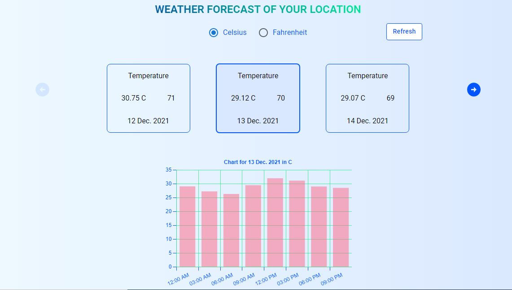

# Payoneer Frontend Assessment Solution

This is a solution to the challenge

## Table of contents

- [Overview](#overview)
  - [The challenge](#the-challenge)
  - [Screenshot](#screenshot)
  - [Links](#links)
  - [Built with](#built-with)
  - [What I learned](#what-i-learned)
  - [Useful resources](#useful-resources)
- [Author](#author)

## Overview

This app is a front end app that was built with React Library, React Tool Kit(RTK) and Material UI.

### The challenge

User should be able to:

- Obtain the weather condition of his/her present location
- The forecast should cover at least 5 days
- To see the average temperature and humidity of each day
- To select any of the display days to see the temperature breakdown of the selected day at an interval of 3hours
- View the optimal layout for each page depending on their device's screen size, showing three days on desktop view and one day on tablet and mobile view
- Click on the pagination arrow to see the next day or next set of 3 days

### Screenshot



### Links

- Live Site URL: [Add live site URL here](https://teeliny-weather-app.netlify.app/)

### Built with

- Semantic HTML5 markup
- CSS custom properties
- Flexbox
- Mobile-first workflow
- [React](https://reactjs.org/) - JS library
- [Material UI](https://mui.com/) - For styles

### What I learned

- How to use material UI components like Box, Container, Button etc

- How to use RTK along with react-redux for state management.

- Changing number of element in a flex box based on screen size produced from a created hook

```js
function useWindowSize() {
  const [width, setWidth] = useState(0);

  useLayoutEffect(() => {
    function updateWidth() {
      setWidth(window.innerWidth);
    }
    window.addEventListener('resize', updateWidth);
    updateWidth();
    return () => window.removeEventListener('resize', updateWidth);
  }, []);
  return width;
}

```

### Useful resources

- [Re render components based on window screen size](https://www.pluralsight.com/guides/re-render-react-component-on-window-resize) - This helped me to render a component on window resize.
- [Testing react components](https://testing-library.com/docs/react-testing-library/intro) - This is an amazing article which helped me to perfect unit testing of react components.
- [React testing with snapshot](https://reactjs.org/docs/test-renderer.html) - This article exposed me to how to grab a snapshot of the platform view.
- [Using react tool kit to create a hook for fetching and caching data](https://redux-toolkit.js.org/rtk-query/overview) - This exposed me to how to use axios under the hood to create a hook for fetching data.

## Author

- GitHub Link - [Add your name here](https://github.com/teeliny)
